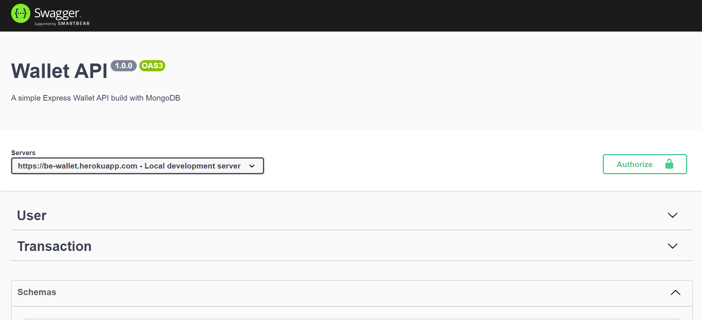

# Wallet - Node.js Rest Api with Express & MongoDB

> Final project GOIT.

Additional description about the project and its features.

## Built With

- Major language - 
- Backend - 
- Technologies used 
  
  
  
  
  
  
  
  
  
  
  
  
  
  
  
  

## Live Demo

[Live Demo Link](https://be-wallet.herokuapp.com/api-docs/)

## Authors

Made with [contributors-img](https://contrib.rocks).

## Show your support

Give a ⭐️ if you like this project!
